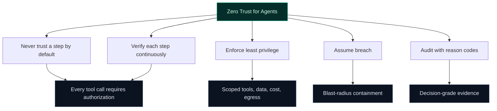

Traditional Zero Trust works well for people and services accessing systems.
Agentic AI breaks that model—because the risk is no longer just *who* is acting,
but *what an agent is about to do*.

Agentic AI breaks the neat boundaries.
An LLM-driven agent can be “authenticated” and still do something unsafe—because the risk is no longer only *who* is asking, but **what the agent is about to do**.

## The missing question in classic Zero Trust

Classic Zero Trust primarily answers:

- **Who** is making the request?
- **Should** that principal access this resource?

Agentic AI introduces a harder operational question:

> **Should this agent perform this action, with this tool, on this data, right now?**

A trusted internal agent can still:
- invoke the wrong tool (or the right tool with the wrong arguments),
- exfiltrate sensitive data in “helpful” responses,
- follow prompt-injected instructions,
- or burn through budgets via runaway loops.

If you’re building agentic systems, you need Zero Trust *at the decision layer*.

## Zero Trust, reinterpreted for agent runtime

To keep the spirit of Zero Trust without mislabeling network controls, define it as:

This is where TealTiger fits: **runtime governance and enforcement** for LLM calls, tool invocations, and output egress.

## Least privilege for agents is not just IAM

In agentic systems, least privilege spans more than access to systems:
- **Tool scope**: which tools an agent may call
- **Action scope**: which side effects are allowed (send email, refund, delete, purchase)
- **Data scope**: what data can be read and what can be emitted
- **Egress scope**: where data can be sent (domains, connectors, destinations)
- **Budget scope**: token/cost ceilings, model-tier constraints, step limits

A simple but high-value pattern is **deny-by-default** for external tools.

## Assume breach: contain prompt injection and hallucinations

Containment patterns that work:
- **Tool gating**: deny or require approval for high-risk tools
- **Egress controls**: redact or block sensitive outputs before they leave the system
- **Step-level escalation**: switch enforcement mode when risk signals rise
- **Budget and loop breakers**: cap tokens, steps, or retries to prevent runaway spend

The point is not “perfect prevention.” The point is **blast-radius reduction**.

## Related docs (TealTiger)

- **Policy modes**: {{ site.docs_base }}/concepts/policy-modes
- **Audit and redaction**: {{ site.docs_base }}/concepts/audit-and-redaction
- **Security vs governance**: {{ site.docs_base }}/concepts/security-vs-governance
- **Zero Trust for Agentic AI (docs page)**: {{ site.docs_base }}/concepts/zero-trust-for-agentic-ai

---

### What to do next

Start with:
1. **Tool inventory** (what can cause side effects?)
2. **Default-deny egress** for sensitive classes
3. **Budget caps** (tokens, cost, step limits)
4. **Reason-coded audit** for every decision

That gets you to “assume breach” maturity quickly—and gives you a safe foundation to scale.
