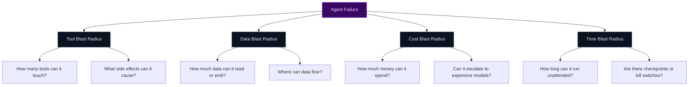

If you are building agentic AI systems, one truth becomes unavoidable very quickly:

> **You will not prevent every failure.**

Models hallucinate.
Prompts get injected.
Tools are misused.
Costs spike.
Data leaks happen in subtle ways.

The real question in production is not *“How do we stop all failures?”*  
It is:

> **“When something goes wrong, how bad can it get?”**

That question is about **blast radius**.

---

## Why prevention-only thinking breaks down

Most AI safety conversations start with prevention:
- better prompts
- better evaluations
- better filters
- better fine-tuning

These are useful.
They are also insufficient.

In complex agentic systems:
- failure modes are combinatorial
- behavior emerges across steps
- risk compounds over time

Prevention reduces probability.
It does **not** limit impact.

Blast-radius control limits impact.

---

## What “blast radius” means for AI agents

In traditional systems, blast radius refers to how many services go down, how much traffic is affected, how much data is exposed.

For AI agents, blast radius spans multiple dimensions:

An agent that fails safely is very different from one that fails expansively.

---

## The uncomfortable reality: assume breach applies to agents too

Agentic AI inherits the Zero Trust lesson the industry learned the hard way:

> **Assume compromise.**

For agents, this means assuming that:
- instructions will be overridden
- reasoning will go wrong
- outputs will be overconfident
- tools will be invoked incorrectly

Designing for “the model behaving correctly” is optimistic.
Designing for “the model behaving incorrectly” is responsible.

---

## Blast-radius control starts with explicit boundaries

The first step is drawing hard boundaries around what an agent can do.

### 1. Tool blast radius
Every tool an agent can call expands its blast radius.

Patterns that work:
- default-deny tool access
- environment-specific tool allowlists
- argument validation and thresholds
- approval gates for irreversible actions

An agent that can *read* is very different from one that can *write*.

---

### 2. Data blast radius
Access is only half the story.
Egress matters just as much.

Control:
- what data can be read
- what data can be emitted
- where outputs can be sent

Effective systems treat **output** as a security boundary, not a UX detail.

Redaction, blocking, and downgrading responses are containment tools.

---

### 3. Cost blast radius
Runaway spend is a real incident class.

Agents fail not only by leaking data, but by:
- looping
- retrying endlessly
- escalating to expensive models
- calling tools repeatedly

Blast-radius control includes:
- token caps
- step limits
- retry ceilings
- model-tier constraints

Cost limits are not optimization knobs.
They are safety controls.

---

### 4. Time blast radius
The longer an agent runs autonomously, the more risk accumulates.

Containment patterns:
- maximum execution windows
- step-by-step re-evaluation
- forced checkpoints
- kill switches

Long-running agents without checkpoints are latent incidents.

---

## Why logging is not blast-radius control

Many teams believe they are safe because they log everything.

Logging helps you understand what happened.
It does **not** stop it from happening.

Blast-radius control requires:
- **intervention**, not observation
- **enforcement**, not dashboards
- **deterministic outcomes**, not postmortems

Logs are necessary.
They are not sufficient.

---

## Runtime enforcement is where blast radius is actually contained

The only place blast radius can be controlled reliably is **at runtime**, at the moment decisions are made.

Effective systems:
- evaluate policy before tool calls
- inspect outputs before egress
- re-evaluate context at each step
- block, redact, or require approval dynamically

This turns failures into **bounded events**, not cascading incidents.

---

## A simple test for your system

Ask this question:

> *If my agent is wrong, maliciously influenced, or confused—what is the worst thing it can do right now?*

If the answer makes you uncomfortable, your blast radius is too large.

---

## The mindset shift that matters

The goal is not:
- perfect models
- perfect prompts
- perfect behavior

The goal is:
- **predictable failure**
- **bounded impact**
- **explainable decisions**

That is what lets organizations deploy agents with confidence.

---

## Related docs (TealTiger)

- **Policy modes**: {{ site.docs_base }}/concepts/policy-modes  
- **Audit and redaction**: {{ site.docs_base }}/concepts/audit-and-redaction  
- **Cost metadata**: {{ site.docs_base }}/audit/cost-metadata  
- **Security vs governance**: {{ site.docs_base }}/concepts/security-vs-governance  

---

### What to do next

To reduce blast radius in agentic systems:

1. Inventory tools and irreversible actions
2. Default-deny external side effects
3. Enforce output egress controls
4. Cap cost, time, and retries
5. Enforce policy at runtime, not in prompts

You don’t need perfect agents.

You need **contained ones**.
