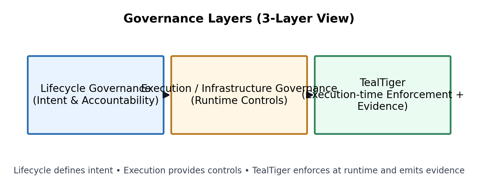
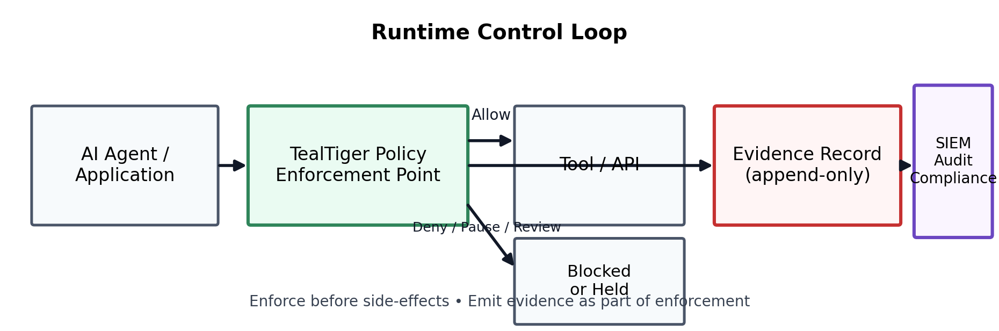
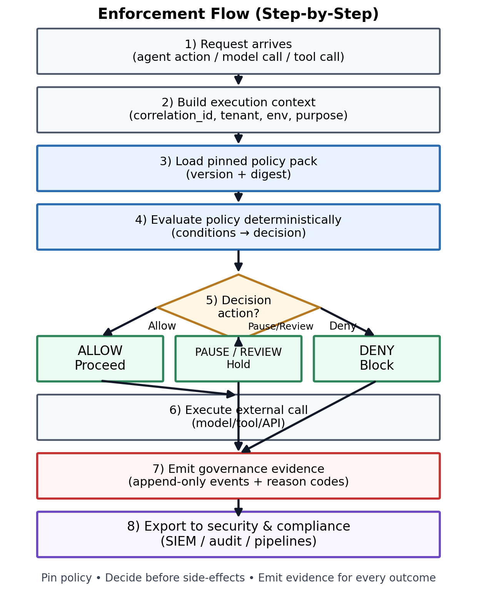

> This post explains where **TealTiger (v1.1.1)** fits in the enterprise AI governance stack today, what role it serves, and what it does **not yet attempt to handle**.
>
> This is **not** a claim that TealTiger replaces lifecycle governance or GRC platforms.

---

## Summary

- **Lifecycle governance** defines intent (risk classification, approvals, evaluations, documentation).
- **Execution / infrastructure governance** supplies runtime controls (access, budgets, tool boundaries, telemetry).
- **TealTiger** sits in the **execution-time enforcement path**, making deterministic allow/deny/pause/review decisions and emitting **machine-readable evidence**.

---

## Table of contents

- [AI Governance Has Crossed an Inflection Point](#ai-governance-has-crossed-an-inflection-point)
- [The Structural Gap in AI Governance](#the-structural-gap-in-ai-governance)
- [Governance Layers (Simplified 3‑Layer View)](#governance-layers-simplified-3layer-view)
- [Why Execution‑Time Enforcement Matters](#why-executiontime-enforcement-matters)
- [TealTiger’s Role: Execution‑Time Governance That Is Enforceable](#tealtigers-role-executiontime-governance-that-is-enforceable)
- [Runtime Control Loop](#runtime-control-loop)
- [Enforcement Flow (Step‑by‑Step)](#enforcement-flow-stepbystep)
- [What TealTiger Does Not Handle (Yet)](#what-tealtiger-does-not-handle-yet)
- [Governance Becomes an Engineering Constraint](#governance-becomes-an-engineering-constraint)
- [Closing: Governance That Cannot Execute Will Not Scale](#closing-governance-that-cannot-execute-will-not-scale)

---

## AI Governance Has Crossed an Inflection Point

Enterprise AI governance is no longer a best‑practice discussion. Operational reality has overtaken policy intent.

As enterprises deploy **agentic AI systems**—systems that call tools, access data, make decisions, and trigger actions—governance failures no longer manifest during reviews or audits. They manifest **at runtime**, when side‑effects already occur.

The governance question is no longer *“Do we have AI policies?”*  
It is now *“Can we enforce them when AI systems act?”*

---

## The Structural Gap in AI Governance

A useful mental model is to separate **governance intent** from **governance execution**.

Most enterprise governance programs span two layers:

- **Lifecycle governance**: risk classification, approvals, bias and quality checks, regulatory documentation, and post‑deployment monitoring.
- **Execution (infrastructure) governance**: model access control, budgets and rate limits, tool invocation control, content boundaries, and audit evidence produced at runtime.

Many organizations invested heavily in the first layer because it mirrors traditional software risk workflows. As autonomy increases, **lifecycle controls alone cannot prevent runtime failures**.

---

## Governance Layers (Simplified 3‑Layer View)

> Optional vector version: `assets/diagram-governance-layers-3.svg`

---

## Why Execution‑Time Enforcement Matters

AI systems no longer behave like passive components reviewed once and deployed indefinitely.

Modern systems dynamically route requests, chain tool calls, operate under variable cost and permission constraints, and act continuously rather than in discrete releases.

In these environments, violations happen in milliseconds, cost overruns occur before dashboards refresh, shadow AI emerges outside approved workflows, and post‑hoc logs explain incidents—but do not prevent them.

Governance that cannot intervene **before execution** is governance that reacts too late.

---

## TealTiger’s Role: Execution‑Time Governance That Is Enforceable

TealTiger is built for **execution‑time governance**, not for replacing upstream policy or lifecycle systems.

Its scope is deliberate and operationally focused:

- Evaluate policy decisions at runtime
- Enforce deterministic outcomes: **Allow / Deny / Pause / Require review**
- Generate **machine‑readable evidence** as a system output
- Export governance telemetry to security and compliance tooling

This makes governance **enforceable**, not merely documented.

---

## Runtime Control Loop

> Optional vector version: `assets/diagram-runtime-control-loop.svg`

---

## Enforcement Flow (Step‑by‑Step)

> Optional vector version: `assets/diagram-enforcement-flow.svg`

---

## What TealTiger Does Not Handle (Yet)

TealTiger does **not** aim to replace:

- Bias and fairness testing platforms
- Model evaluation or model‑card systems
- Enterprise GRC workflow tools
- Executive dashboards and compliance scorecards

Those capabilities belong to **lifecycle governance**.

TealTiger’s purpose is complementary: **ensure that decisions approved upstream are enforced downstream**, where AI systems actually act.

---

## Governance Becomes an Engineering Constraint

As autonomy rises, governance stops being only a policy problem and becomes an **engineering constraint**.

Policies without enforcement remain aspirations. Documentation without execution becomes narrative.

Enterprises that scale AI safely will:

- Retain lifecycle governance for intent and accountability
- Add execution‑time governance for enforcement and evidence
- Treat governance as a system behavior rather than a slide deck

---

## Closing: Governance That Cannot Execute Will Not Scale

The AI governance challenge is not a lack of frameworks or regulation. It is a lack of **controls that operate where decisions occur**.

TealTiger’s role is to close that gap—enforcing policy at runtime, producing defensible evidence, and complementing lifecycle governance platforms without claiming to replace them.

As AI systems become more autonomous, governance that cannot execute will always arrive too late.

---

### Reference

- Maxim AI — *Top 5 Enterprise AI Governance Tools for Secure and Responsible AI*  
  https://www.getmaxim.ai/articles/top-5-enterprise-ai-governance-tools-for-secure-and-responsible-ai/

https://www.tealtiger.ai  
https://blogs.tealtiger.ai
