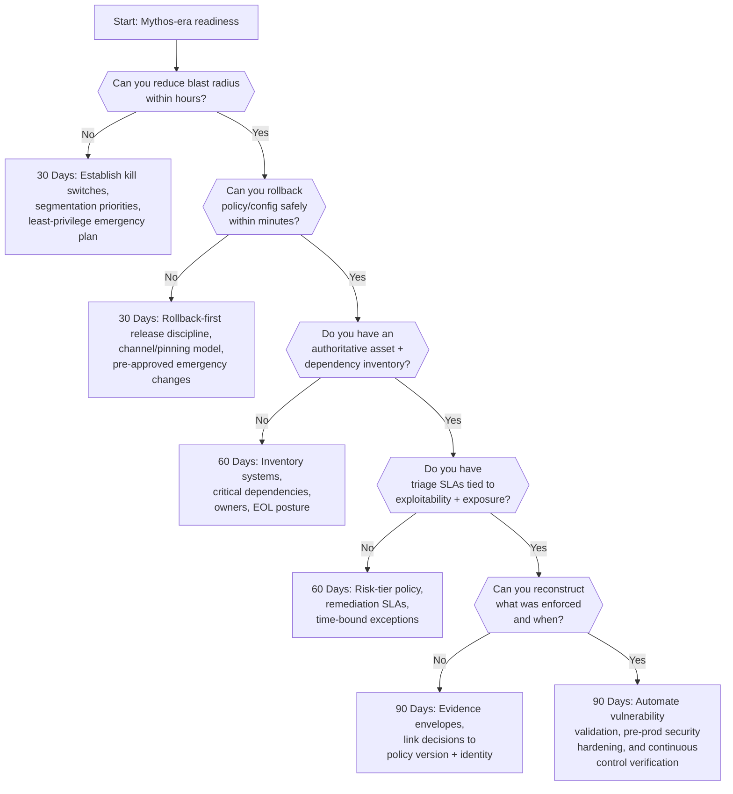
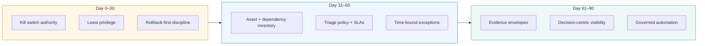
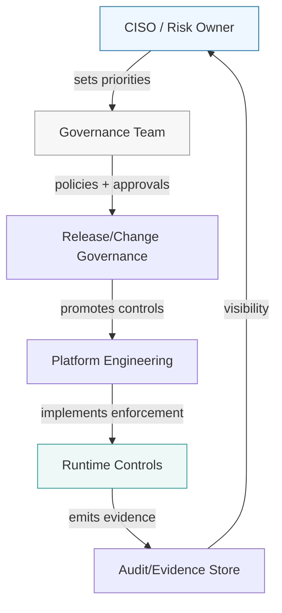

# Mythos‑Era CISO Decision Tree: What to Prioritize in the Next 30/60/90 Days

*Date: 2026-04-17*  
*Audience: CISOs, Deputy CISOs, Security Leaders, Risk Owners*  

---

## Executive summary

When exploit windows compress and vulnerability volume spikes, CISOs need a **sequenced plan** that prioritizes:
1) blast radius reduction, 2) rollback speed, 3) inventory + triage, 4) evidence + automation.

This post provides a decision tree and a 30/60/90 day execution plan.

---

## Visual 1 — CISO decision tree (30/60/90)

---

## Visual 2 — 30/60/90 plan as an execution pipeline

---

# 30 / 60 / 90 Day Priorities

## First 30 Days: Stop the bleeding (blast radius + rollback)

### Blast-radius controls (must be fast)
- Establish kill switch authority (who can stop what, with audit trail).
- Enforce least privilege for service identities and tool access.
- Prioritize segmentation of the most exposed/high-value paths (identity, CI, prod control planes).

### Rollback-first change governance
- Define an emergency change class with pre-approved playbooks and clear approval authority.
- Implement progressive rollout and a rollback procedure that can be executed under stress.

**30-day success criteria**
- You can disable high-risk capabilities quickly.
- You can rollback configuration/policy quickly.

---

## Next 60 Days: Win the prioritization war (inventory + triage)

### Authoritative inventory
- Build an inventory of critical services and owners, critical dependencies, internet-facing assets, and EOL systems.

### Risk-tier SLAs and exception governance
- Create a policy that ties exposure (public/internal), exploitability (working exploit exists), and business criticality to remediation timelines and time-bound exceptions.

**60-day success criteria**
- You know what you run and who owns it.
- You can triage vulnerability floods without chaos.

---

## Next 90 Days: Build audit-grade response speed (evidence + automation)

### Evidence-first incident response
- Implement an evidence model that links policy/config version, identity, decision outcome, reason code, and timestamp.

### Defensive automation (governed)
- Use automation to validate exploitability, test mitigations, and prioritize patching.

**90-day success criteria**
- You can prove what controls were active.
- You can respond faster than attacker iteration cycles.

---

## Visual 3 — Operating model (who does what)

---

## Pitfalls to avoid

1) More governance documents without enforcement.
2) Rollback that exists only on paper.
3) Prioritizing by vulnerability counts instead of exposure + exploitability.

---

## Disclaimer

This decision tree is reference guidance and does not imply certification or guarantee compliance.
