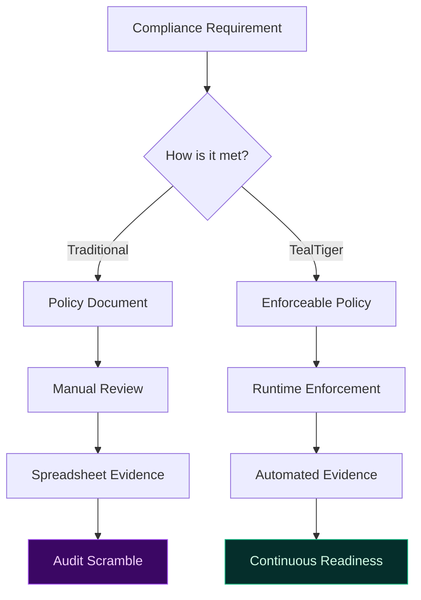
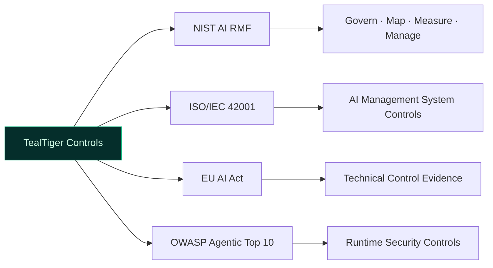

# Compliance Enablement with TealTiger

TealTiger is **compliance-enabling, not compliance-completing**.

Final compliance accountability always remains with the organization. TealTiger provides the deterministic controls, verifiable enforcement, and auditable evidence that make compliance programs operational — not just documented.

---

## The Compliance Gap in Agentic AI

Most compliance programs for AI systems rely on documentation and periodic reviews. In agentic environments where behavior changes at runtime, this approach creates gaps between what is documented and what actually happens.

---

## What TealTiger Provides

| Capability | Compliance Value |
|-----------|-----------------|
| **Deterministic controls** | Prove that policies produce consistent outcomes |
| **Immutable evidence** | Decision-grade artifacts generated at enforcement time |
| **Policy-to-control traceability** | Map governance contracts to framework requirements |
| **Versioned policies** | Demonstrate which policy was in effect for any decision |
| **Reason-coded decisions** | Explain *why* an action was allowed or denied |

---

## Supported Frameworks

TealTiger's governance model aligns with major frameworks — as a control and evidence layer, not as a certification tool.

| Framework | TealTiger's Role |
|-----------|-----------------|
| **NIST AI RMF** | Operational controls for Govern, Map, Measure, Manage functions |
| **ISO/IEC 42001** | Technical evidence for AI management system control objectives |
| **EU AI Act** | Technical and operational control evidence for high-risk AI |
| **OWASP Agentic Top 10** | Runtime security controls for agentic threat categories |

---

## Important Disclaimer

TealTiger does not certify compliance. It provides:
- Controls that can be mapped to framework requirements
- Evidence that supports compliance assessments
- Enforcement that reduces the gap between policy and practice

The organization retains full responsibility for its compliance program, including risk assessments, organizational controls, and regulatory engagement.

---

## Practical Checklist

- [ ] Map TealTiger governance contracts to your target framework requirements
- [ ] Configure evidence export for audit and assessment workflows
- [ ] Use policy versioning to demonstrate control consistency over time
- [ ] Include TealTiger decision logs in compliance evidence packages
- [ ] Review framework mappings when regulations or standards update
- [ ] Maintain clear documentation of what TealTiger covers vs organizational controls

---

## Related

- [Governance Frameworks](/governance/frameworks/) — Framework operationalization
- [Evidence & Audit](/governance/evidence/) — Decision-grade evidence generation
- [Risk Assurance](/governance/risk-assurance/) — Continuous risk control
