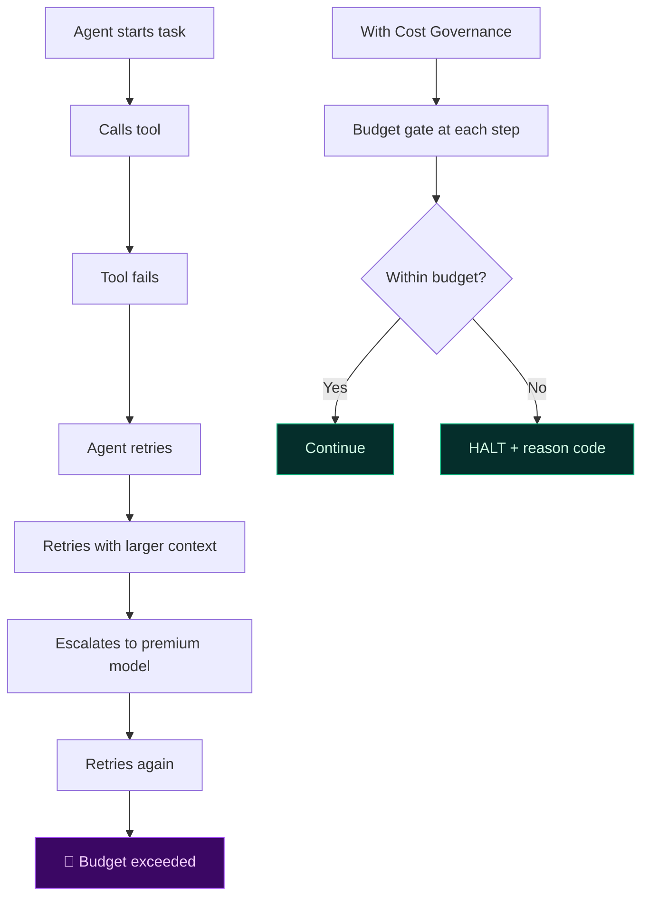
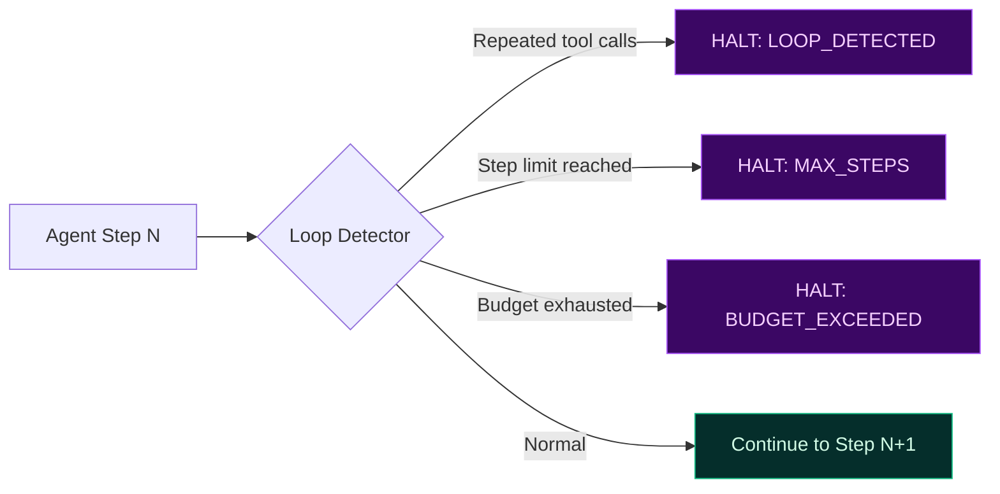

# Economic Governance of Agentic Execution

In agentic systems, cost is not a billing concern — it is an **execution risk**. Unbounded autonomy leads to runaway spend. A single agent loop can burn through a monthly budget in minutes.

TealTiger treats cost as a **governance outcome**, enforced deterministically at runtime.

---

## Why Cost Must Be Governed at Runtime

Post-hoc cost analysis cannot prevent damage. By the time you see the invoice, the spend has already happened.

Governance must intervene **before** spend occurs — not report on it afterward.

---

## Budget-Aware Execution Policies

TealTiger policies express cost constraints as enforceable boundaries:

| Constraint | What it controls |
|-----------|-----------------|
| Per-run cost ceiling | Maximum spend for a single agent execution |
| Per-tool call budget | Cost limit per individual tool invocation |
| Step limits | Maximum number of planning/execution steps |
| Retry ceilings | Maximum retries before forced termination |
| Model tier caps | Prevent escalation to expensive models without approval |
| Time-based limits | Maximum wall-clock execution time |

These are evaluated at each decision point — not just at the start of execution.

---

## Loop Detection and Termination

Runaway agents are the most common source of cost incidents. TealTiger detects and terminates loops through:

Termination is a **valid governance outcome**. A safely stopped agent is better than a bankrupt one.

---

## Degrade Paths (Not Just Stop)

Cost governance isn't always binary. TealTiger supports graduated responses:

1. **Continue** — within budget, proceed normally
2. **Degrade** — switch to cheaper model, reduce tool scope, shrink context
3. **Approve** — pause and request human approval for continued spend
4. **Halt** — stop execution, return partial results with reason code

This prevents "all or nothing" enforcement that frustrates developers.

---

## Evidence for Cost Decisions

Every halt, degrade, or deny decision emits structured evidence:

- **Why** execution stopped (reason code: `BUDGET_EXCEEDED`, `MAX_RETRIES`, `LOOP_DETECTED`)
- **Which** policy threshold was crossed
- **What** the execution state was at termination
- **How much** was spent before the decision

This supports FinOps reviews, incident response, and audit.

---

## Practical Checklist

- [ ] Set per-run cost ceilings for every agent workflow
- [ ] Add step limits and retry ceilings
- [ ] Implement loop detection (repeated tool calls, repeated plan fragments)
- [ ] Define degrade paths (cheaper model, reduced scope)
- [ ] Require approval for premium model escalation
- [ ] Emit reason-coded evidence for every cost decision
- [ ] Review cost policies monthly as provider pricing changes

---

## Related

- [Runtime Governance](/governance/runtime/) — Enforcement at execution boundaries
- [Model Governance](/governance/model/) — Model tier constraints
- [Evidence & Audit](/governance/evidence/) — Proving cost governance decisions
