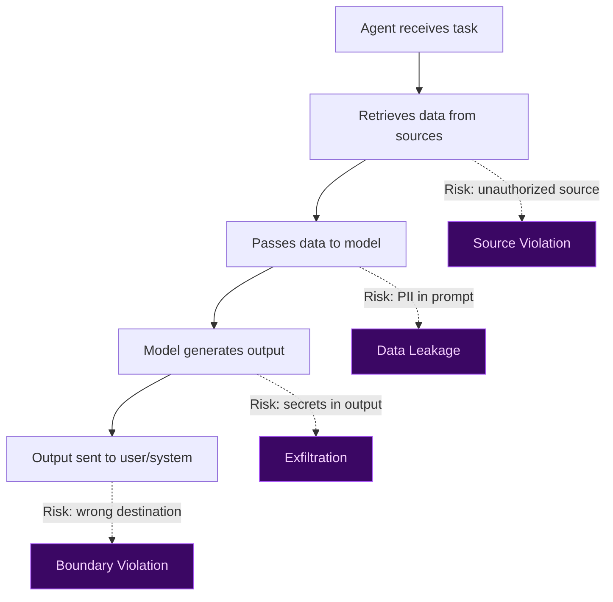
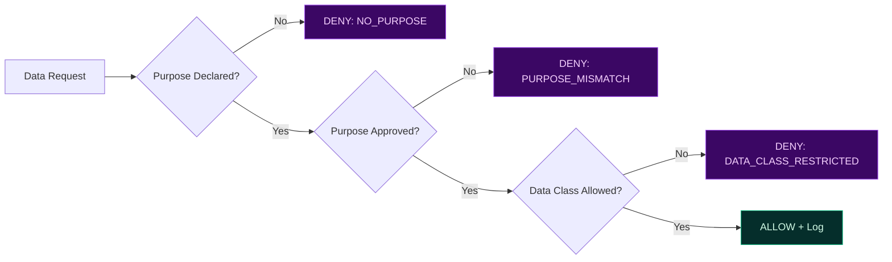
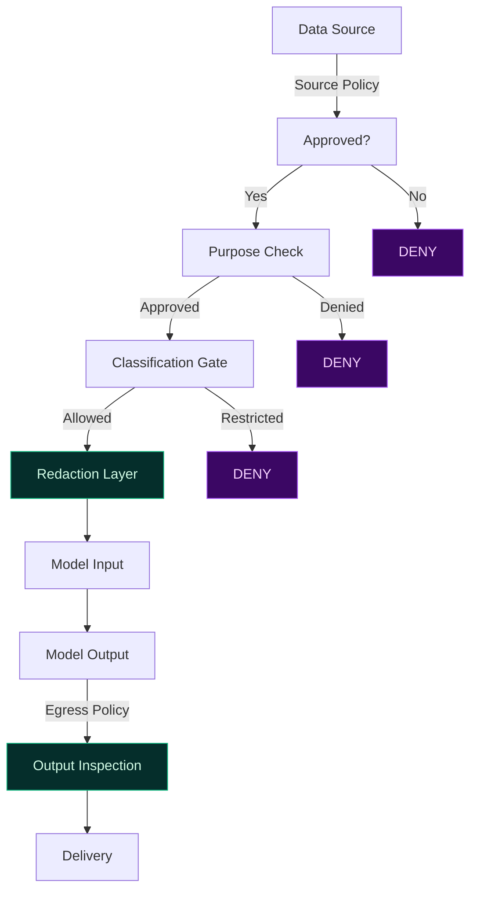

# Data Governance for Agentic AI

Data is the highest-risk input to AI systems. In agentic environments, agents can read, transform, and emit data across boundaries that were never intended to be crossed.

TealTiger enforces **data governance before model invocation** — not after generation.

---

## Why Data Governance Is Different for Agents

Traditional data governance focuses on access control and retention policies. Agentic systems introduce new risks:

The risk is not just *who* accesses data — it's *how data flows through the agent pipeline*.

---

## Governance Focus Areas

### 1. Source Control

Only approved data sources are accessible to agents. Unapproved sources are denied at the policy layer.

| Control | Description |
|---------|-------------|
| Source allowlist | Only named sources can be queried |
| Environment scoping | Different sources for dev vs prod |
| Classification gates | Regulated data requires explicit approval |

### 2. Purpose Binding

Data access is limited to declared purposes. An agent retrieving customer data for "support" cannot use it for "analytics."

### 3. Deterministic Redaction

Sensitive fields are removed or masked **before** data reaches the model:
- PII (emails, phone numbers, SSNs, credit cards)
- Secrets and credentials
- Regulated fields (PHI, financial data)

Redaction is not optional or best-effort. It is a policy-enforced transformation.

### 4. Egress Boundaries

Data leaving the system is inspected and controlled:
- Approved destinations only
- Sensitivity-aware blocking
- Aggregation requirements for exports

---

## Enforcement Model

Policies are evaluated *before* data reaches the model — not after generation. This prevents data leakage, cross-domain contamination, and regulatory violations **by design**.

---

## Practical Checklist

- [ ] Maintain an allowlist of approved data sources per agent/workflow
- [ ] Require declared purpose for every data access
- [ ] Apply deterministic redaction before model invocation
- [ ] Inspect outputs for sensitive data before egress
- [ ] Emit evidence for every data access decision
- [ ] Scope data permissions by environment and tenant

---

## Related

- [Security Governance](/governance/security/) — Identity and access enforcement
- [Evidence & Audit](/governance/evidence/) — Proving data governance decisions
- [Compliance Enablement](/governance/compliance/) — Regulatory alignment
