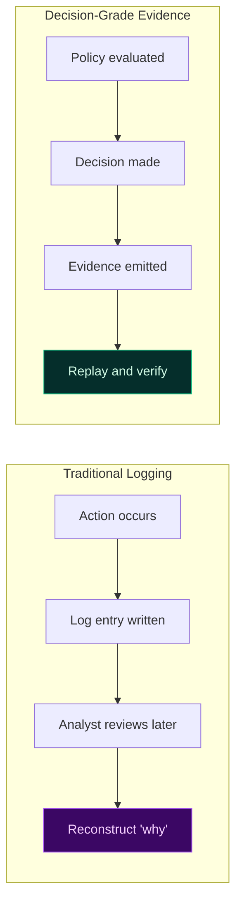
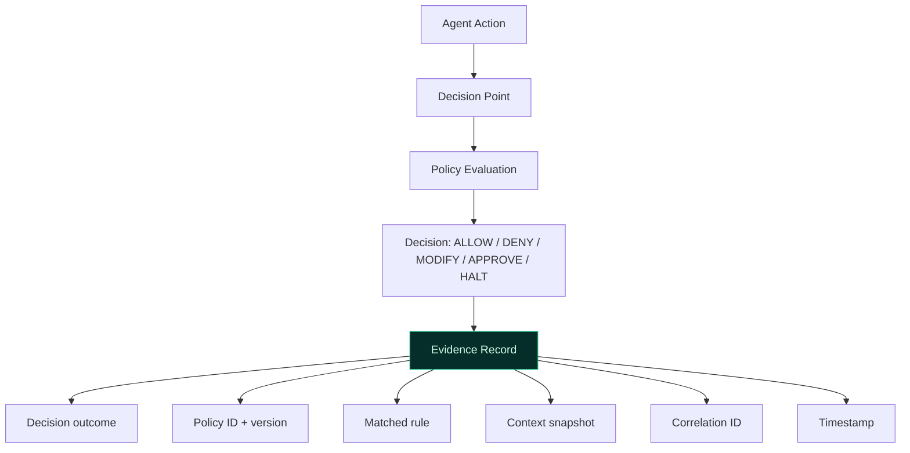

# Deterministic Audit & Evidence for Agentic AI

Audits fail when systems rely on logs to explain decisions after the fact. In agentic systems, governance requires **evidence generated at decision time**, not forensic reconstruction later.

TealTiger treats audit and evidence as **first-class runtime outputs**, tightly coupled to policy evaluation and enforcement.

---

## Why Logs Are Not Evidence

Traditional observability answers *what happened*. Governance must answer *why it was allowed*.

Common gaps in log-based approaches:
- Logs lack policy context (which rule matched?)
- Decisions cannot be replayed (what would happen with the same inputs?)
- Policy versions are unclear (which policy was in effect?)
- Exceptions are undocumented (who approved the override?)

In agentic systems, these gaps compound quickly across multi-step executions.

---

## Evidence as a Governance Artifact

TealTiger produces structured evidence **per decision**:

Every evidence record answers:
- **What** decision was made
- **Why** (which policy, which rule)
- **When** (timestamp, execution step)
- **With what context** (minimally sufficient, sensitivity-aware)
- **Under which policy version**

---

## Replayability and Assurance

Replayability is the key property that separates evidence from logs:

> Given the same policy version and context, the same decision would occur.

This enables:
- **Internal assurance reviews** — verify decisions without re-running agents
- **External audits** — demonstrate control effectiveness with proof
- **Incident postmortems** — understand exactly why something was allowed or denied
- **Regression testing** — ensure policy changes produce expected outcomes

---

## Policy Versioning and Traceability

Every decision is tied to a **specific policy version**. This prevents silent policy drift.

| Property | What it ensures |
|----------|----------------|
| **Versioned policies** | Behavior is tied to the exact policy in effect |
| **Change traceability** | Policy updates are explicit and reviewable |
| **Time-bound exceptions** | Overrides expire and are recorded |
| **Decision replay** | Any past decision can be verified against its policy version |

---

## Practical Audit Patterns

### Decision Timelines
Reconstruct the full sequence of governance decisions for any agent run — what was allowed, denied, modified, or escalated at each step.

### Exception Registers
Track every approval override: who approved, under what policy, with what context, and when the exception expires.

### Evidence Export
Send decision artifacts to your audit store, SIEM, or compliance platform:
- JSONL for structured ingestion
- HTTP sink for real-time streaming
- Correlation IDs for cross-system tracing

---

## Practical Checklist

- [ ] Emit structured evidence for every governance decision
- [ ] Include policy version in every evidence record
- [ ] Capture minimally sufficient context (avoid logging sensitive data)
- [ ] Support evidence replay for audit and assurance
- [ ] Export evidence to your audit/SIEM infrastructure
- [ ] Maintain exception registers with time-bound approvals

---

## Related

- [Governance Foundations](/governance/foundations/) — Contract-first principles
- [Runtime Governance](/governance/runtime/) — Where decisions happen
- [Compliance Enablement](/governance/compliance/) — Using evidence for compliance
