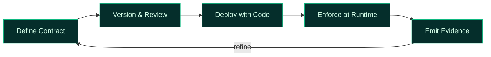
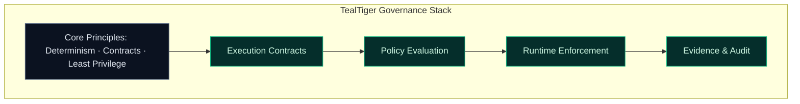

# Governance Foundations for Agentic AI

TealTiger governance starts with a **contract-first, deterministic foundation**. Governance is not an afterthought or an advisory layer — it is a system property.

---

## Why Foundations Matter

Without foundations, governance becomes probabilistic, inconsistent, and impossible to audit.

```mermaid
flowchart TD
  subgraph Without["Without Foundations"]
    A1["Ad-hoc rules"] --> B1["Inconsistent decisions"]
    B1 --> C1["Audit gaps"]
    C1 --> D1["Compliance failure"]
  end

  subgraph With["With TealTiger Foundations"]
    A2["Explicit contracts"] --> B2["Deterministic decisions"]
    B2 --> C2["Versioned evidence"]
    C2 --> D2["Verifiable assurance"]
  end

  style A1 fill:#3b0764,stroke:#a855f7,color:#f5d0fe
  style B1 fill:#3b0764,stroke:#a855f7,color:#f5d0fe
  style C1 fill:#3b0764,stroke:#a855f7,color:#f5d0fe
  style D1 fill:#3b0764,stroke:#a855f7,color:#f5d0fe
  style A2 fill:#052e2b,stroke:#10b981,color:#d1fae5
  style B2 fill:#052e2b,stroke:#10b981,color:#d1fae5
  style C2 fill:#052e2b,stroke:#10b981,color:#d1fae5
  style D2 fill:#052e2b,stroke:#10b981,color:#d1fae5
```

TealTiger establishes **explicit contracts** that define what agents are allowed to do *before* execution begins.

---

## Core Principles

### 1. Determinism by Design

Every governance decision produces the same outcome for the same inputs. No probabilistic behavior, no silent drift, no "it depends."

This is the property that makes governance **trustworthy at scale**:
- Same request + same policy version + same context = **same decision**
- Exceptions are explicit, scoped, and recorded
- A deny is not a suggestion — it is a stop condition

### 2. Contract-First Enforcement

Governance rules are declared, versioned, and frozen before deployment. Contracts define:
- What tools an agent may use
- What data it may access
- What cost boundaries apply
- When human approval is required

### 3. Policy as Infrastructure

Governance policies are deployed alongside code, not embedded in prompts. They are:
- **Versioned** — tied to specific releases
- **Testable** — validated before deployment
- **Auditable** — every change is traceable

### 4. Enforcement Over Observation

Logging tells you what happened. Governance decides what is *allowed* to happen. TealTiger enforces at decision boundaries — not in dashboards.

---

## What TealTiger Enforces

| Domain | What is governed | How |
|--------|-----------------|-----|
| **Tools** | Which tools an agent may invoke | Allowlists, parameter constraints, approval gates |
| **Data** | What data can be read or emitted | Source control, purpose binding, redaction |
| **Cost** | How much an agent can spend | Budget ceilings, step limits, loop breakers |
| **Models** | Which models are approved | Model allowlists, task-type bindings |
| **Risk** | What risk levels are acceptable | Risk scoring, threshold enforcement |

---

## The Foundation Stack

Every governance domain — runtime, security, data, cost, compliance — builds on these foundations. Without them, controls are fragile. With them, governance becomes **repeatable, testable, and auditable**.

---

## Outcome

Organizations that adopt contract-first governance gain:
- **Predictability** — behavior is defined before deployment
- **Accountability** — every decision is traceable to a policy version
- **Scalability** — governance scales with autonomy, not against it
- **Auditability** — evidence is generated by design, not reconstructed

---

## Related

- [Runtime Governance](/governance/runtime/) — How contracts are enforced during execution
- [Evidence & Audit](/governance/evidence/) — How decisions produce verifiable proof
- [Governance Frameworks](/governance/frameworks/) — How foundations map to standards
