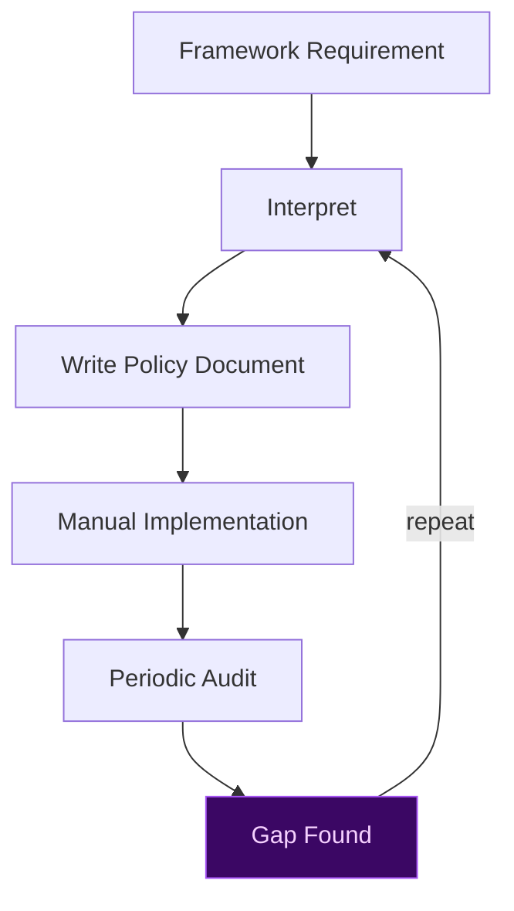
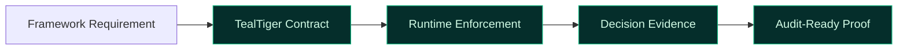

# Governance Frameworks and TealTiger

Governance frameworks provide **structure and shared language**, but they do not enforce behavior by themselves. TealTiger is designed to **operationalize governance frameworks through deterministic enforcement**.

---

## The Problem with Framework-Only Governance

Most frameworks:
- Describe *what* good governance looks like
- Do not specify *how* controls are enforced
- Rely on manual interpretation and process maturity

This creates gaps between intent and execution — gaps that widen in agentic systems where behavior changes at runtime.

---

## How TealTiger Aligns with Frameworks

TealTiger maps governance frameworks to **explicit, enforceable controls**:

| Framework | TealTiger Mapping |
|-----------|------------------|
| **NIST AI RMF** | Govern → contracts, Map → risk classification, Measure → evidence, Manage → enforcement |
| **ISO/IEC 42001** | Control objectives → enforceable policies with versioned evidence |
| **EU AI Act** | Technical control evidence for high-risk AI system requirements |
| **OWASP Agentic Top 10** | Runtime security controls mapped to agentic threat categories |

---

## Contract-to-Framework Mapping

TealTiger governance contracts serve as the bridge between abstract framework requirements and operational enforcement:

- **Define control intent** — what the framework requires, expressed as policy
- **Enforce control behavior** — deterministic evaluation at runtime decision points
- **Produce immutable evidence** — decision-grade artifacts tied to policy versions

This allows organizations to *prove* framework alignment, not just claim it.

---

## Important Note

TealTiger does not certify compliance with any framework. It provides the technical controls and evidence that support an organization's compliance program. Framework alignment is a continuous process that requires organizational commitment beyond tooling.

---

## Practical Checklist

- [ ] Identify target framework requirements relevant to your AI systems
- [ ] Map requirements to TealTiger governance contracts
- [ ] Configure enforcement policies that satisfy control objectives
- [ ] Export decision evidence aligned to framework audit expectations
- [ ] Review mappings when frameworks are updated

---

## Related

- [Compliance Enablement](/governance/compliance/) — Compliance-enabling controls
- [Evidence & Audit](/governance/evidence/) — Decision-grade evidence
- [Governance Foundations](/governance/foundations/) — Core principles
