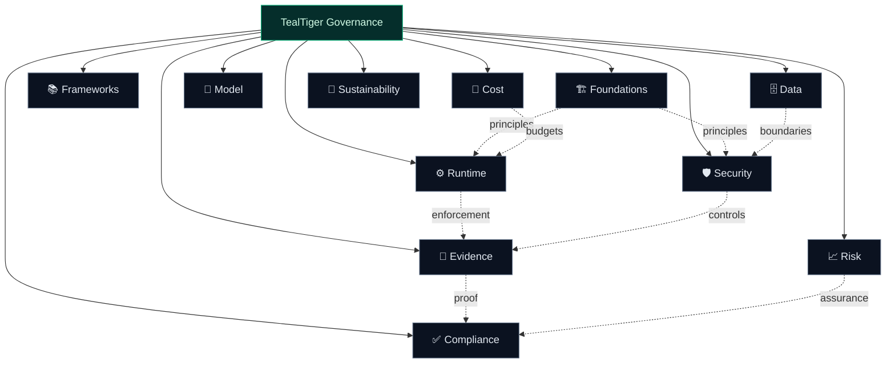

TealTiger Governance is built for **deterministic enforcement** in agentic AI systems.

This section is organized as **Governance Hubs**. Each hub contains a hub overview and core articles.

> **Recommended read order:** Foundations → Runtime → Security → Evidence

---

## Governance Hubs

### 1) [Foundations](/governance/foundations/)
The contract-first principles that make governance repeatable, testable, and auditable.

### 2) [Frameworks & Standards](/governance/frameworks/)
How TealTiger operationalizes governance frameworks through deterministic controls.

### 3) [Runtime Governance](/governance/runtime/)
Governance at execution time: prompt execution, tool invocation, and scope control.

### 4) [Security](/governance/security/)
Identity-bound execution, least-privilege access, and deny-by-default enforcement.

### 5) [Data Governance](/governance/data/)
Purpose binding, source control, and deterministic data boundaries.

### 6) [Model Governance](/governance/model/)
Explicit control over approved models, tasks, and risk boundaries.

### 7) [Cost & Economic Governance](/governance/cost/)
Preventing runaway execution and enforcing cost as a governance constraint.

### 8) [Risk Assurance](/governance/risk-assurance/)
Continuous evaluation of agent actions against explicit risk boundaries.

### 9) [Evidence & Audit](/governance/evidence/)
Immutable, verifiable evidence generated directly from governance enforcement.

### 10) [Compliance Enablement](/governance/compliance/)
Compliance-enabling controls and evidence without over-claiming compliance completion.

### 11) [Sustainability](/governance/sustainability/)
Sustainability as a governance outcome: operational, financial, and organizational.

---

## How to Use This Section

| Role | Recommended Path |
|------|-----------------|
| **Builders** | Foundations → Runtime → Security → Data |
| **Operators** | Runtime → Evidence → Risk Assurance |
| **Auditors / GRC** | Frameworks → Compliance → Evidence |

---

## Notes

- TealTiger is **compliance-enabling**, not a complete compliance program.
- Governance hubs are stable; core articles evolve with versioned capabilities.
