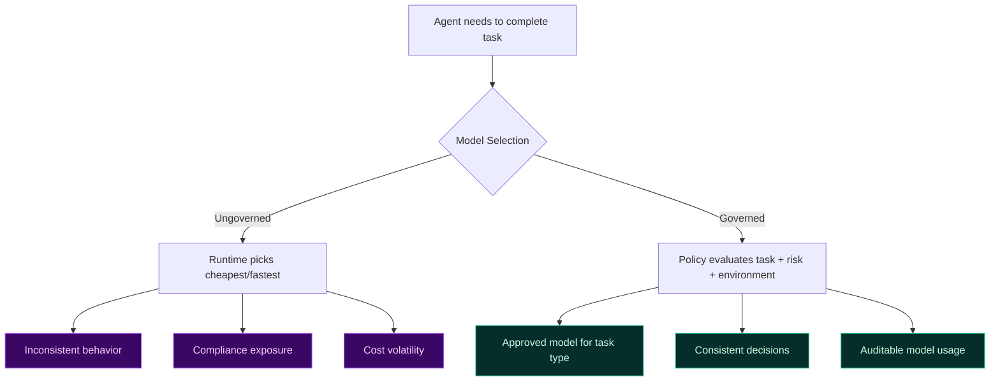
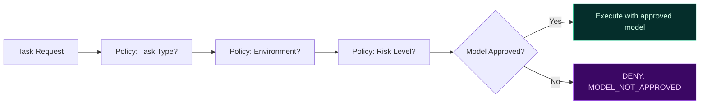

# Model Governance and Control

Not all models are equal. Different models carry different risk profiles, cost characteristics, and compliance implications. In agentic systems, uncontrolled model switching is a governance failure.

TealTiger introduces **explicit model governance** — deterministic control over which models run, for what purposes, and under what constraints.

---

## Why Model Governance Matters

Without model governance:
- Different models may be used silently for the same task
- Risk characteristics change without review
- Compliance assumptions break when models are swapped
- Cost becomes unpredictable

---

## What Is Governed

| Dimension | Control |
|-----------|---------|
| **Model allowlist** | Only named models/versions are permitted |
| **Task binding** | Models are approved for specific task categories |
| **Risk classification** | High-risk tasks require approved high-capability models |
| **Environment scoping** | Different models for dev vs staging vs production |
| **Cost tier** | Premium models require explicit budget approval |

---

## Deterministic Model Selection

Model usage is driven by governance contracts, not runtime heuristics or framework defaults.

Every model decision is:
- **Explicit** — no implicit fallbacks
- **Traceable** — policy version and model version recorded
- **Deterministic** — same task + same context = same model selection

---

## Preventing Silent Model Drift

Model drift happens when:
- A framework auto-selects a different model version
- A developer changes a default without review
- A provider deprecates a model and the system falls back silently

TealTiger prevents this by treating model selection as a **policy-enforced decision**, not a configuration default. Changes require policy updates, which are versioned and reviewable.

---

## Practical Checklist

- [ ] Maintain an allowlist of approved models per environment
- [ ] Bind models to task categories (e.g., "summarization" → approved models only)
- [ ] Require explicit approval for premium/expensive model tiers
- [ ] Log model selection decisions with policy version
- [ ] Alert on model usage outside approved boundaries
- [ ] Review model governance quarterly as providers update offerings

---

## Related

- [Cost Governance](/governance/cost/) — Model tier constraints and budget enforcement
- [Risk Assurance](/governance/risk-assurance/) — Risk classification for model selection
- [Governance Foundations](/governance/foundations/) — Contract-first principles
