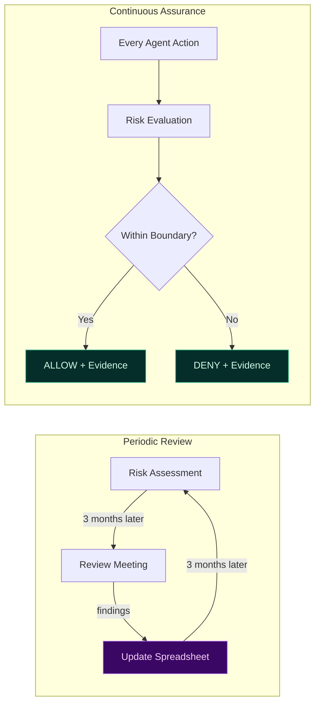
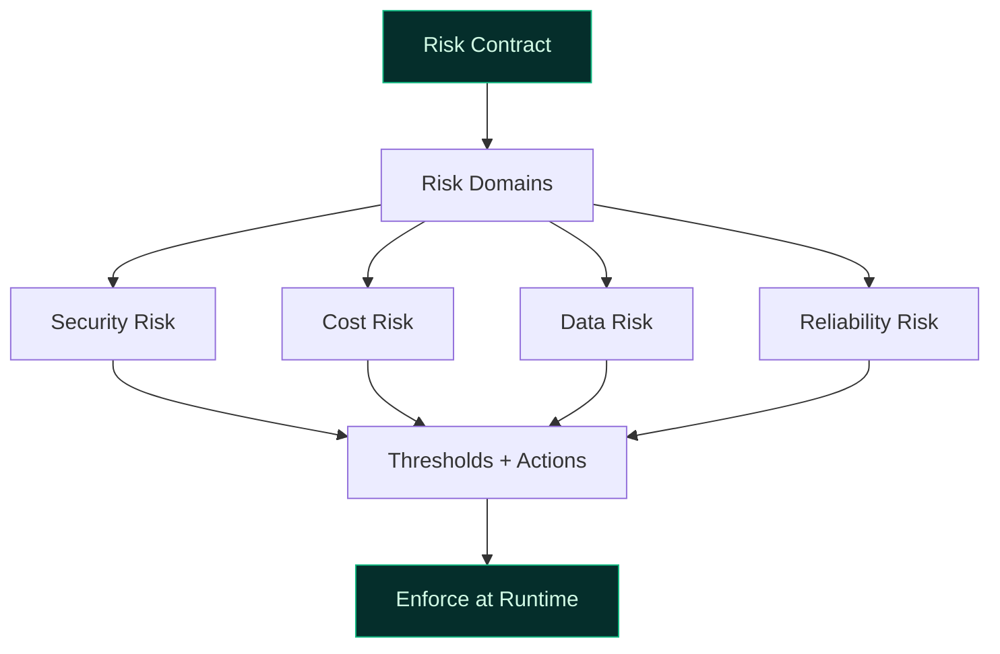

# Risk Assurance for Agentic AI

Risk assurance answers a critical question:

> **Are AI risks continuously controlled — or only periodically reviewed?**

In agentic systems, point-in-time risk assessments become stale the moment agents start executing. TealTiger enables **continuous risk assurance** through deterministic enforcement.

---

## The Problem with Periodic Risk Reviews

Traditional risk assessments are snapshots. Agentic systems evolve at runtime — tools change, data sensitivity shifts, agent behavior adapts. By the next quarterly review, the risk landscape has already moved.

---

## Risk in Agentic Systems

Agentic AI introduces risks that compound across execution steps:

| Risk Category | Example |
|--------------|---------|
| **Scope expansion** | Agent discovers new tools and starts using them |
| **Tool misuse** | Correct tool, wrong arguments, wrong environment |
| **Data overreach** | Agent accesses data beyond its declared purpose |
| **Model drift** | Behavior changes when model versions update |
| **Cost escalation** | Retries and loops inflate spend silently |
| **Privilege creep** | Low-risk steps chain into high-impact actions |

---

## TealTiger Risk Assurance Model

### 1. Explicit Risk Contracts

Risks are declared, classified, and bounded in governance contracts — not left to runtime interpretation.

### 2. Continuous Evaluation

Every agent action is evaluated against approved risk boundaries. Risk scoring spans four domains:
- **Security** — tool access, data sensitivity, privilege level
- **Cost** — spend rate, budget remaining, model tier
- **Data** — classification, purpose alignment, egress destination
- **Reliability** — step count, retry rate, convergence signals

### 3. Deterministic Outcomes

Risk violations produce consistent, explainable decisions:
- **ALLOW** — within all risk boundaries
- **RESTRICT** — reduce scope (cheaper model, fewer tools)
- **REQUIRE_APPROVAL** — pause for human review
- **DENY** — risk exceeds acceptable threshold

No probabilistic "risk scores that sometimes trigger." Same inputs, same policy, same outcome.

---

## Assurance Artifacts

TealTiger generates evidence that supports assurance without manual reconstruction:

- **Risk decision logs** — every evaluation with outcome and reason codes
- **Policy violation records** — what was denied and why
- **Boundary crossing alerts** — when risk approaches thresholds
- **Audit-ready exports** — structured evidence for internal and external review

---

## Practical Checklist

- [ ] Define risk boundaries per agent workflow (security, cost, data, reliability)
- [ ] Set risk thresholds that trigger restrict/approve/deny outcomes
- [ ] Evaluate risk at every decision point, not just at entry
- [ ] Emit reason-coded evidence for every risk decision
- [ ] Review risk contracts when agent capabilities change
- [ ] Use assurance artifacts for continuous compliance readiness

---

## Related

- [Governance Foundations](/governance/foundations/) — Contract-first principles
- [Security Governance](/governance/security/) — Security-specific risk controls
- [Evidence & Audit](/governance/evidence/) — Proving risk decisions
- [Compliance Enablement](/governance/compliance/) — Regulatory alignment
