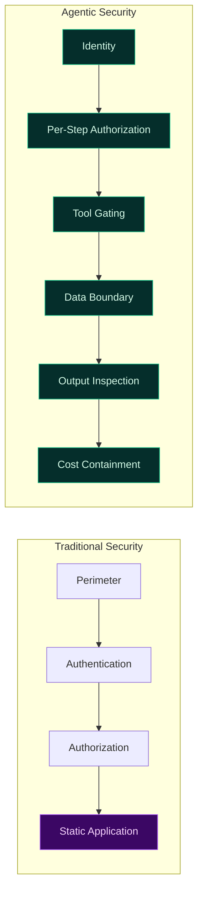
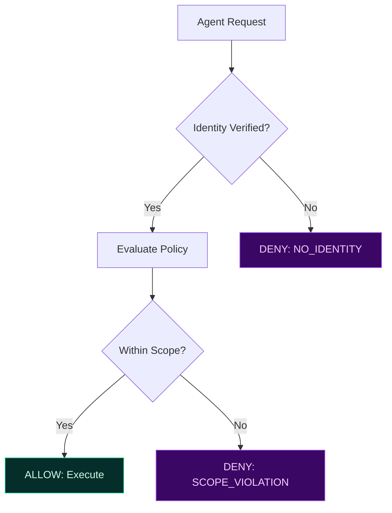
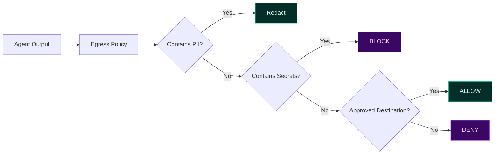

# Security Governance for Agentic AI Systems

Agentic systems introduce a new attack surface: **autonomous decision-making**. Traditional perimeter security assumes static applications with predictable flows. Agents break both assumptions.

TealTiger applies security governance **at execution time**, where risk actually materializes.

---

## The Threat Model Shift

Traditional security asks: **"Who is making this request?"**

Agentic security must also ask: **"Should this agent perform this action, with this tool, on this data, right now?"**

A trusted internal agent can still:
- invoke the wrong tool (or the right tool with wrong arguments)
- exfiltrate sensitive data in "helpful" responses
- follow prompt-injected instructions
- burn through budgets via runaway loops

---

## TealTiger Security Controls

### 1. Identity-Bound Execution

Every agent action is bound to a verifiable identity. No anonymous execution.

Identity includes:
- Agent type and version
- Execution environment (dev/staging/prod)
- Tenant and workflow context
- Correlation ID for traceability

### 2. Least-Privilege Tooling

Agents can only invoke tools explicitly granted by policy. Everything else is denied.

| Principle | Implementation |
|-----------|---------------|
| Default deny | No tool access unless explicitly allowed |
| Scoped permissions | Tools allowed per environment, workflow, agent type |
| Parameter constraints | Arguments validated against policy rules |
| Approval gates | High-risk tools require human approval |

### 3. Deterministic Deny-by-Default

Anything not explicitly allowed is denied. No implicit trust, no "the model decided it was safe."

Every deny produces:
- A stable reason code (`TOOL_NOT_ALLOWED`, `SCOPE_VIOLATION`, `DATA_BOUNDARY_EXCEEDED`)
- Policy version that made the decision
- Context snapshot for audit

### 4. Output Egress Controls

Security doesn't end at tool invocation. Outputs must be inspected before leaving the system:

---

## Security Outcomes

- **Reduced blast radius** — agents cannot escalate beyond approved boundaries
- **Enforced separation of duties** — different agents have different permissions
- **Audit-ready security logs** — every decision is traceable and replayable
- **No silent escalation** — privilege creep is structurally prevented

---

## Practical Checklist

- [ ] Bind every agent to a verifiable identity
- [ ] Default-deny all tool access; allowlist explicitly
- [ ] Validate tool arguments against policy constraints
- [ ] Inspect outputs before egress (redact/block/approve)
- [ ] Emit reason-coded evidence for every security decision
- [ ] Scope permissions by environment, tenant, and workflow

---

## Related

- [Zero Trust Across Governance Hubs](/governance/security/zero-trust-governance-hubs-series/) — Zero Trust as a governance pattern
- [Runtime Governance](/governance/runtime/) — Enforcement at execution boundaries
- [Evidence & Audit](/governance/evidence/) — Proving security decisions
