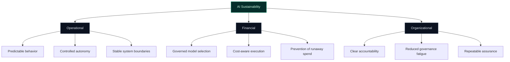

# Sustainability and Responsible AI Operations

Sustainability in AI governance is not only environmental — it is **operational, financial, and organizational**. TealTiger treats sustainability as a governance outcome.

---

## Dimensions of AI Sustainability

---

## Why Governance Enables Sustainability

Without governance, AI systems become unsustainable:

| Without Governance | With Governance |
|-------------------|----------------|
| Unpredictable costs | Budget-aware execution |
| Silent scope creep | Explicit boundaries |
| Governance fatigue | Automated enforcement |
| Manual compliance | Continuous evidence |
| Reactive incident response | Proactive containment |

Governance is the mechanism that keeps AI systems **controllable as they scale**.

---

## Operational Sustainability

Systems that behave predictably are systems that last. Operational sustainability means:
- Agents operate within defined boundaries
- Failures are bounded, not cascading
- Behavior is deterministic and reproducible
- Changes are versioned and reviewable

---

## Financial Sustainability

AI costs compound with autonomy. Financial sustainability requires:
- Per-run and per-workflow budget enforcement
- Model tier governance (prevent silent escalation)
- Loop detection and termination
- Cost evidence for FinOps and planning

---

## Organizational Sustainability

Governance programs fail when they depend entirely on human vigilance. Organizational sustainability means:
- Automated enforcement reduces manual review burden
- Evidence generation replaces audit scrambles
- Policy-as-code enables team-wide consistency
- Progressive rollout modes prevent governance fatigue

---

## Practical Checklist

- [ ] Enforce cost boundaries to prevent financial unsustainability
- [ ] Use deterministic policies to ensure operational predictability
- [ ] Automate evidence generation to reduce organizational burden
- [ ] Review governance policies quarterly for continued relevance
- [ ] Monitor governance overhead — controls should enable, not obstruct

---

## Related

- [Cost Governance](/governance/cost/) — Financial sustainability controls
- [Risk Assurance](/governance/risk-assurance/) — Continuous risk control
- [Governance Foundations](/governance/foundations/) — Core principles
